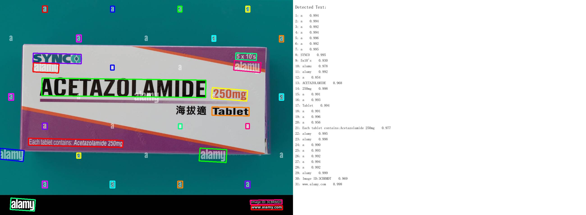
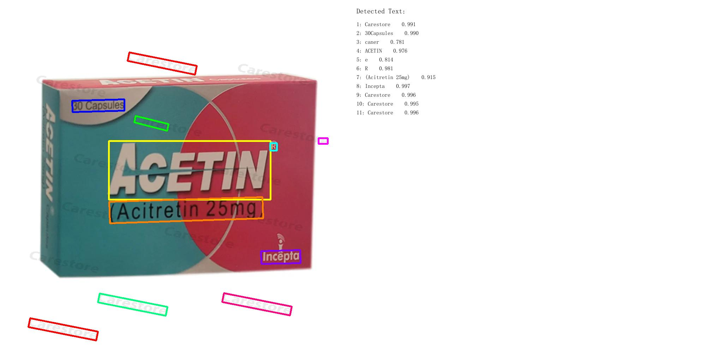

# PaddleOCR Drug Name Detection

Sistem deteksi dan klasifikasi nama obat dari gambar kemasan menggunakan PaddleOCR dan Damerau-Levenshtein distance matching.

> **Note:** Dataset ini masih berupa sample awal. Hasil evaluasi akan berubah seiring penambahan data.

## Struktur Proyek

```
├── train.py                  # OCR detection + simpan hasil ke pickle
├── evaluate.py               # Evaluasi prediksi dari hasil OCR
├── dataset.csv               # Ground truth (Image Name, Label)
├── models/
│   ├── damerau_levenshtein.py  # Fungsi jarak string (DL, WER, CER)
│   └── drug_graph.py           # Drug Synonym Graph (brand vs generik)
├── utils/
│   └── rename_images.py        # Rename gambar secara berurutan
├── sample obat/                # Input gambar per folder obat
│   ├── Abacavir/
│   ├── Abbotic/
│   └── ...
└── output/                     # Hasil OCR (gambar + pickle)
    ├── Abacavir/
    ├── Abbotic/
    └── ocr_results.pkl
```

## Alur Kerja

1. **`train.py`** — Jalankan PaddleOCR pada semua gambar di `sample obat/`, hasilkan gambar bounding box + panel teks, dan simpan semua hasil OCR ke `output/ocr_results.pkl`.

2. **`evaluate.py`** — Load hasil OCR dari pickle, cocokkan dengan label di `dataset.csv` menggunakan Damerau-Levenshtein similarity, lalu tampilkan evaluasi lengkap.

```
python train.py
python evaluate.py
```

## Sample Hasil OCR

Berikut contoh output dari `train.py`. Gambar kiri menunjukkan bounding box pada teks yang terdeteksi, panel kanan menampilkan teks hasil OCR beserta confidence score.

**Abacavir**


**Acetazolamide**



**Acetin**



## Metode Klasifikasi

Sistem ini tidak menggunakan machine learning untuk klasifikasi. Prediksi dilakukan dengan:

1. **Damerau-Levenshtein Distance** — Menghitung jarak edit (insert, delete, substitute, transpose) antara setiap token OCR dengan semua label obat yang diketahui. Label dengan similarity score tertinggi dipilih sebagai prediksi.

2. **Drug Synonym Graph** — Menangani konflik antara nama merk dan nama generik. Contoh: kemasan "Acetin" juga mencantumkan "Acetylcysteine" (nama generiknya). Graph akan memilih nama merk karena kemasan bermerek selalu memuat nama generik di label.

## Hasil Evaluasi (Sample)

### Ringkasan

| Metrik | Nilai |
|---|---|
| Total gambar | 310 |
| Prediksi benar | 298 |
| Accuracy | 96.13% |
| Average WER (Raw OCR) | 48.39% |
| Average WER (Setelah DL) | 3.87% |
| Average CER (Raw OCR) | 25.51% |
| Average CER (Setelah DL) | 3.04% |

- **Raw OCR** = perbandingan token OCR mentah terdekat dengan true label
- **Setelah DL** = perbandingan predicted label (hasil DL matching) dengan true label

### Per-Label Breakdown

| Label | Jumlah | Accuracy | WER (Raw) | CER (Raw) | WER (DL) | CER (DL) |
|---|---|---|---|---|---|---|
| Abacavir | 41 | 92.7% | 65.85% | 38.41% | 7.32% | 6.10% |
| Abbotic | 19 | 100.0% | 63.16% | 20.30% | 0.00% | 0.00% |
| Abemaciclib | 37 | 91.9% | 72.97% | 32.68% | 8.11% | 6.14% |
| Abiraterone | 17 | 100.0% | 76.47% | 31.55% | 0.00% | 0.00% |
| Abrocitinib | 19 | 100.0% | 84.21% | 51.20% | 0.00% | 0.00% |
| Acalabrutinib | 28 | 100.0% | 21.43% | 10.16% | 0.00% | 0.00% |
| Acarbose | 40 | 92.5% | 37.50% | 31.25% | 7.50% | 5.94% |
| Acebutolol | 6 | 100.0% | 100.00% | 61.67% | 0.00% | 0.00% |
| Acepress | 10 | 100.0% | 20.00% | 2.50% | 0.00% | 0.00% |
| Acetazolamide | 39 | 97.4% | 28.21% | 10.06% | 2.56% | 1.78% |
| Acethion | 5 | 100.0% | 20.00% | 15.00% | 0.00% | 0.00% |
| Acetin | 14 | 100.0% | 78.57% | 44.05% | 0.00% | 0.00% |
| Acetylcysteine | 35 | 94.3% | 8.57% | 6.12% | 5.71% | 4.49% |

Damerau-Levenshtein matching berhasil menurunkan WER secara signifikan dari 48.39% (raw OCR) menjadi 3.87%, dan CER dari 25.51% menjadi 3.04%. Ini menunjukkan bahwa meskipun OCR sering mendeteksi teks yang tidak relevan atau terpotong, DL similarity mampu mencocokkan token yang tepat ke label obat yang benar.

Label dengan accuracy di bawah 100% (Abacavir, Abemaciclib, Acarbose, Acetazolamide, Acetylcysteine) umumnya gagal karena gambar tidak mengandung teks nama obat yang cukup jelas untuk dicocokkan oleh OCR.

### Sample Kesalahan Prediksi

| Gambar | True Label | Predicted | Score |
|---|---|---|---|
| image_2.png | Abacavir | Abiraterone | 0.4545 |
| image_24.jpg | Abacavir | Acarbose | 0.375 |
| image_71.jpeg | Abemaciclib | Acarbose | 0.375 |
| image_163.webp | Acarbose | Abiraterone | 0.1429 |
| image_225.jpg | Acetazolamide | Acarbose | 0.375 |
| image_286.jpg | Acetylcysteine | Abbotic | 0.375 |

Score yang rendah pada prediksi yang salah menunjukkan bahwa OCR tidak berhasil mendeteksi teks nama obat pada gambar tersebut, sehingga DL matching memilih label yang salah berdasarkan fragmen teks lain yang kebetulan mirip.
